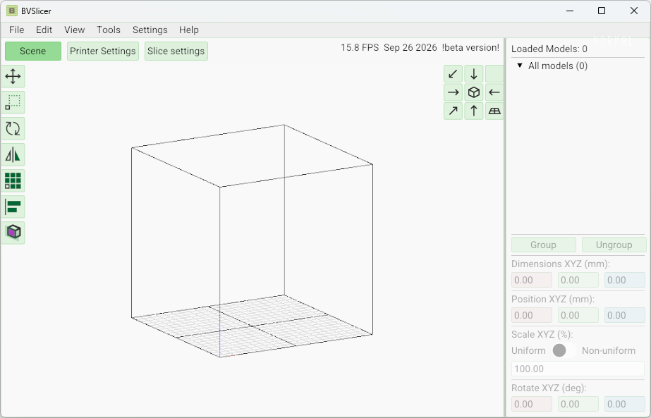

  

# BVSlicer Demo

**3D-слайсер для Binder Jetting печати**

---

## 📋 О программе

**BVSlicer** — настольное приложение для подготовки (нарезки) 3D-моделей для принтеров, работающих по технологии **Binder Jetting**. Программа позволяет загрузить модели, разместить их на платформе построения, настроить параметры слайсинга и получить растеризованный послойный вывод (`.tiff` / `.prn`).

### Основные возможности

- **Загрузка 3D-моделей** — поддержка форматов `.stl`, `.obj`, `.3mf` и других (через Assimp)
- **Интерактивная 3D-сцена** — быстрый рендер на **Vulkan API**, ортографическая/перспективная камера, пресеты видов, гизмо-трансформации (перемещение, поворот, масштаб)
- **Редактирование сцены** — копирование/вставка моделей, массивы, выравнивание и распределение, отмена/повтор действий (Undo/Redo)
- **Нарезка (слайсинг)** — генерация контуров, периметров и заполнения (infill), дизеринг (Blue Noise), растеризация слоёв в TIFF через AGG
- **Проекты** — сохранение и загрузка проекта `.3mf` со всеми моделями и позициями
- **Гибкие настройки** — отдельные профили программы, принтера и нарезки
- **PRN-декодер** — открытие файлов `.prn` и конвертация в `.tiff` (декодирование растеризованного вывода принтера)
- **Локализация интерфейса** — Русский, English

Полное описание работы с программой — в окне **Помощь → О программе**

---

## 📖 Использование

1. Запустите `BVSlicer DEMO.exe`.
2. **Файл → Открыть файл** (`Ctrl+O`) — загрузите 3D-модель (`.stl`, `.obj`, `.3mf`).
3. Разместите модели на платформе: перемещение, поворот, масштабирование, массив, выравнивание.
4. Настройте профили на вкладках **«Настройки»**, **«Настройки принтера»**, **«Настройки нарезки»**.
5. **Инструменты → Нарезать всё** — в демо версии нарезка отключена.

### Поддерживаемые форматы файлов

| Расширение | Назначение |
|------------|-----------|
| `.stl`, `.obj` | Вход: 3D-модели |
| `.3mf` | Проект (модели + позиции) |
| `.ini` | Настройки программы |
| `.printer` | Настройки принтера (стол, DPI, режим вывода) |
| `.slice` | Настройки нарезки (высота слоя, дизеринг, стенки) |
| `.tiff` | Выход: растеризованный послойный срез |
| `.prn` | Выход: принтерный сплайс-файл |
